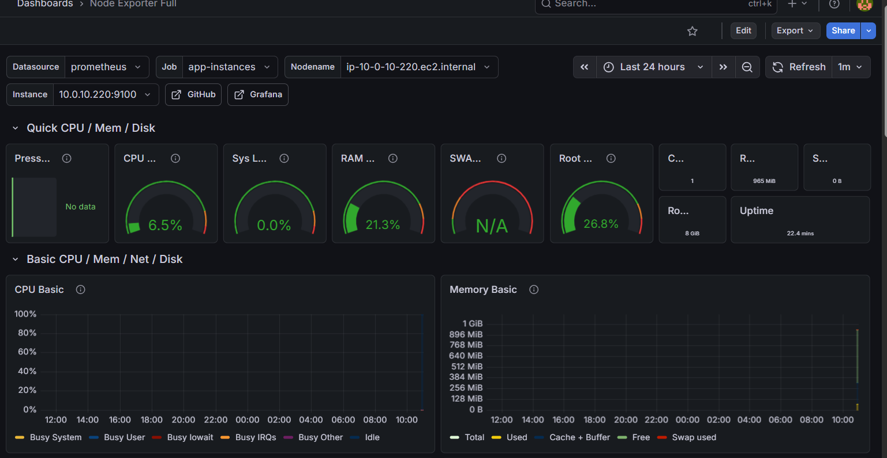

# AWS Infrastructure Monitoring Platform

A production-style AWS infrastructure with automated cost optimisation 
and full observability stack — entirely provisioned via Terraform.

## Architecture
```
GitHub Actions (CI/CD)
        ↓
Terraform provisions:
├── VPC (public/private subnets, IGW, NAT Gateway)
├── Bastion Host (public subnet)
├── App EC2 x2 (private subnets, Node Exporter)
├── Monitoring EC2 (Prometheus + Grafana)
├── Lambda Functions (EC2 Scheduler + EBS Cleanup)
└── EventBridge Schedules (automated triggers)
        ↓
Prometheus scrapes all EC2 instances
        ↓
Grafana dashboards visualise metrics
```

## Tech Stack

- **Infrastructure as Code:** Terraform (modular design, remote state)
- **Cloud:** AWS (VPC, EC2, Lambda, EventBridge, IAM, S3, DynamoDB)
- **Automation:** Python (boto3) Lambda functions
- **Monitoring:** Prometheus + Grafana + Node Exporter
- **CI/CD:** GitHub Actions (Terraform plan on PR, apply on merge)
- **State Management:** S3 + DynamoDB locking

## Project Structure
```
aws-infrastructure-monitoring-platform/
├── terraform/
│   ├── main.tf              # Root module, wires everything together
│   ├── variables.tf         # Input variables
│   ├── outputs.tf           # Output values
│   └── modules/
│       ├── vpc/             # VPC, subnets, IGW, NAT, routing
│       ├── compute/         # EC2 instances, security groups
│       ├── lambda/          # Lambda functions, IAM, EventBridge
│       └── monitoring/      # Monitoring configuration
├── lambda/
│   ├── ec2_scheduler.py     # Stops/starts EC2s on schedule
│   └── ebs_cleanup.py       # Deletes unattached EBS volumes
├── monitoring/
│   ├── prometheus.yml       # Prometheus scrape config
│   └── docker-compose.yml   # Prometheus + Grafana + Node Exporter
└── .github/
    └── workflows/
        └── terraform.yml    # GitHub Actions CI/CD pipeline
```

## Cost Optimisation Automation

Two Lambda functions handle automated cost saving:

**EC2 Scheduler** — triggered by EventBridge cron
- Stops dev EC2 instances at 7pm weekdays
- Starts dev EC2 instances at 8am weekdays
- Filters by tags: `Environment=dev`, `ManagedBy=lambda-scheduler`

**EBS Cleanup** — triggered every Sunday
- Scans for unattached EBS volumes tagged `Environment=dev`
- Deletes volumes with no active attachment
- Logs GB freed per run to CloudWatch

## Monitoring Stack

Prometheus scrapes metrics from all EC2 instances via Node Exporter.
Grafana visualises CPU, memory, disk, and network metrics in real time.



## CI/CD Pipeline

GitHub Actions runs on every push and PR:

| Trigger | Action |
|---------|--------|
| Pull Request | terraform fmt, validate, plan |
| Push to main | terraform apply |

Lambda zip files are packaged automatically in the pipeline — 
no manual build steps required.

## Remote State

Terraform state is stored remotely:
- **S3 bucket:** `aws-monitoring-platform-tfstate-389226936297`
- **DynamoDB table:** `terraform-state-lock` (state locking)
- **Encryption:** enabled

## Lessons Learned

- `.terraform` directory must be in `.gitignore` — provider binaries 
  are 600MB+ and will be rejected by GitHub
- Prometheus `labels` must be nested inside `static_configs`, 
  not at the `scrape_config` level
- Lambda zip files must be built in the CI pipeline since they 
  are excluded from version control
- EC2 public IPs change on restart — use Elastic IPs or DNS 
  for production workloads

## Prerequisites

- AWS CLI configured
- Terraform >= 1.0
- Python 3.11

## Usage
```bash
# Initialise
cd terraform
terraform init

# Plan
terraform plan

# Apply
terraform apply

# Destroy (remember to do this to avoid costs)
terraform destroy
```
